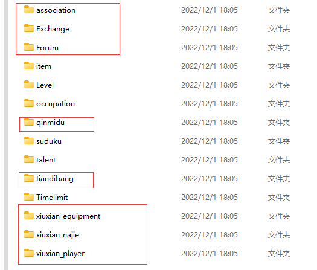

# 绝云间修仙2.3.0 【仙韵绕春华】

# 请注意！本插件进入停更状态！目前正在准备重写！有需要联系QQ2531606029

## QQ游玩反馈群：906061358

### 更新注意！2.3版本更新后，需要安装mysql支持
1. 自行前往mysql官网下载最新版本mysql并安装完毕，设置好密码
2. 在config/database文件夹下配置好MySQL用户信息
3. Yunzai-Bot/目录下执行  
```
pnpm install mysql --workspace-root

```


## 玩家攻略：
[修仙攻略](https://docs.qq.com/doc/DSUhqZWdpZXJuUndZ?&u=4bd0757f64094c48b02d7cfc4eaeb44b)  
[异界攻略](https://docs.qq.com/doc/DU1pmVFNReVlvdEJP)
## 访问量：        
<br> <br>       

## 如需查看大版本更新日志，请前往[官网](http://xialuo.top/)(补偿仅对本人开的服务器)

## 安装      

> Yunzai-Bot/目录下执行  
```
git clone  https://gitee.com/xialuo03/xiuxian-emulator-plugin.git ./plugins/xiuxian-emulator-plugin/

```
> 如需拉取canary分支，请在Yunzai-Bot/目录下执行  
```
git clone  -b canary https://gitee.com/xialuo03/xiuxian-emulator-plugin.git ./plugins/xiuxian-emulator-plugin/

```
> 如需从原插件更改至本插件，可在Yunzai-Bot/plugins/xiuxian-emulator-plugin/目录下执行
```
git remote set-url master https://gitee.com/xialuo03/xiuxian-emulator-plugin.git
```
```
git fetch

```
> 然后安装依赖 （为适应频道，后续均需安装依赖）
```
pnpm install -P

``` 

## 转移存档            
     
存档位置  
```
\Yunzai-Bot\plugins\xiuxian-emulator-plugin\resources\data
由于异界版本，请在转移存档的同时转移data下yijie文件夹，否则会数据丢失！
```      

若要转移存档，将上面画框的文件保存，将修仙插件删除，执行上面安装命令

## 更新内容
要获取最新更新内容发"#查看日志"即可查看

## 配置与存档   
>xiuxian-emulator-plugin/ config / xiuxian / xiuxian.yaml       
>xiuxian-emulator-plugin/ resources / data          
>可根据需求自行修改     

## 免责声明       
功能仅限内部交流与小范围使用    

## 原作者信息
原插件：[@ningmengchongshui](https://gitee.com/ningmengchongshui)  
原作者：[@DDZS](https://gitee.com/hutao222)[@屑洛](https://gitee.com/xialuo03)